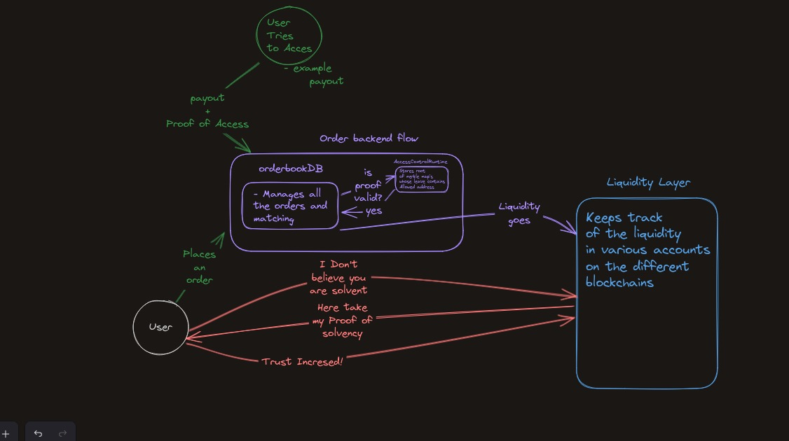
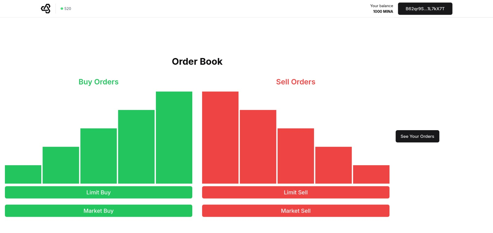
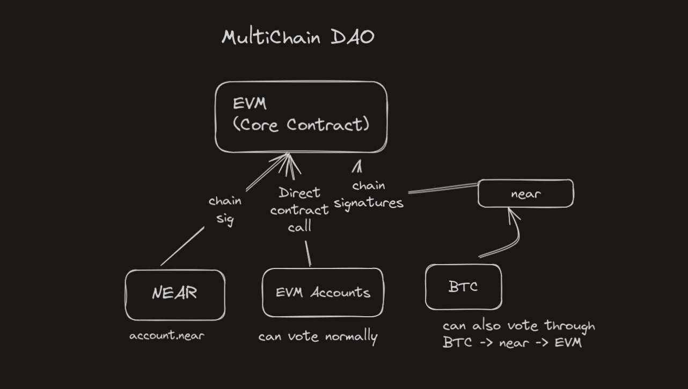

# WELCOME TO  STEALTHTRADE DAO 

Our Project for ETHSingapore Hackathon 

## $60+ Trillion Dollar Market Overview

The cumulative trading volume of perpetual contracts since 2020 has exceeded $60 trillion, surpassing the trading volume of both underlying cryptocurrencies and conventional futures contracts.

### Problems in Perpetual Markets

#### Open Order Books: Challenges
1. **Front Running**: Visible pending orders allow traders to manipulate transaction ordering to their advantage.
2. **Copy Trading Exploitation**: Competitors can duplicate visible strategies, profiting unfairly from others' trades.
3. **Lack of Privacy**: Exposure of traders' strategies and positions can be exploited by market analysts and competitors.
4. **Market Manipulation**: The transparency of open order books can be abused to manipulate markets and liquidity.

#### Private Order Books: Challenges
1. **Trust Deficit**: Users can't verify platform solvency, raising concerns about asset backing for open positions.
2. **Hidden Liquidity**: Lack of visibility into market depth makes order execution uncertain.
3. **Manipulation Risk**: Market can be manipulated by the platform or privileged users without detection.
4. **User Trust**: Lack of transparency, especially during volatility, can drive users away.

### Stealth DAO: The Solution

**How We Solve These Issues:**
- **Private Order Book System**: Implementing private order books enhanced by **access proofs** and **proof of solvency** to ensure transparency and foster user trust.
- **Partial Public Data**: Some market data remains public to avoid a gambling-like environment, while the system's core operates in a decentralized, transparent manner.
- **Chain Abstracted DAO**: A decentralized governance model allowing users to propose and vote on changes to the platform and perpetual contracts.
- **Cross-Chain Voting**: Cross-chain voting ensures that all stakeholders have a say in the platform's evolution, enhancing trust and transparency.

For more Details <a href='https://stealthtradedao.gitbook.io/stealthtradedao'> read our exclusive docs</a>